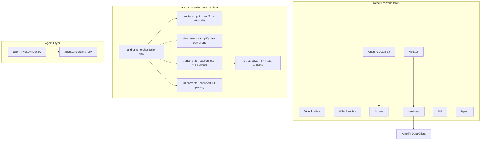

# Design Document: Codebase Refactoring

## Overview

This design describes the refactoring of the You2Book codebase to improve maintainability, debuggability, and code quality without changing business logic. The refactoring targets three layers: the `fetch-channel-videos` Lambda handler (TypeScript), the React frontend (TypeScript), and the Python backend (Agent Invoker Lambda + Agentcore FastAPI server).

The primary structural change is decomposing the monolithic ~500-line Lambda handler into focused modules. Secondary changes include standardizing error handling patterns, adding structured logging, removing dead/duplicated code, and adding tests for pure utility functions.

## Architecture

The overall system architecture remains unchanged. The refactoring affects internal module boundaries within each layer:



### Key Architectural Decisions

1. **Module extraction over class hierarchy**: The Lambda handler functions are extracted into plain TypeScript modules with exported functions rather than classes. This matches the existing functional style and avoids unnecessary abstraction.

2. **Shared Amplify client initialization stays in handler.ts**: The top-level `await getAmplifyDataClientConfig()` and `Amplify.configure()` must remain at the module level of the handler entry point since it runs at cold start. The `client` instance is passed as a parameter to database functions.

3. **No new dependencies**: The refactoring uses only existing libraries. Structured logging is achieved through consistent `console.log` with JSON-serializable objects rather than adding a logging framework.

## Components and Interfaces

### Lambda Handler Module Decomposition

#### `handler.ts` (orchestration)

Remains the entry point. Reduced to orchestration logic only: validates input, calls modules in sequence, assembles the response.

```typescript
// handler.ts - slimmed down to orchestration
export const handler: Schema["fetchChannelVideos"]["functionHandler"] = async (event) => {
  const correlationId = crypto.randomUUID()
  // 1. Validate input & extract owner
  // 2. Call extractChannelId(channelUrl)
  // 3. Call fetchChannelMetadata(channelId, apiKey)
  // 4. Call fetchAllVideos(channelId, apiKey)
  // 5. Call upsertChannel(client, channelData, owner)
  // 6. Call saveVideos(client, videos, channelId, owner, apiKey, bucketName)
  // 7. Return structured response
}
```

#### `url-parser.ts`

```typescript
export function extractChannelId(url: string): string
```

Pure function. No dependencies. Easily testable.

#### `srt-parser.ts`

```typescript
export function stripSrtTimestamps(srtContent: string): string
```

Pure function. No dependencies. Easily testable.

#### `youtube-api.ts`

```typescript
export async function fetchChannelMetadata(channelId: string, apiKey: string): Promise<string>
export async function fetchAllVideos(channelId: string, apiKey: string): Promise<YouTubeVideo[]>
export async function fetchTranscript(videoYoutubeId: string, apiKey: string): Promise<string | null>

export interface YouTubeVideo {
  youtubeId: string
  title: string
  description: string
  duration: string
}
```

Groups all YouTube Data API interactions. Uses axios for HTTP calls.

#### `transcript.ts`

```typescript
export async function processTranscript(params: {
  videoYoutubeId: string
  channelId: string
  owner: string
  apiKey: string
  bucketName: string
}): Promise<{ success: boolean; key?: string }>

export function buildTranscriptKey(owner: string, channelId: string, videoYoutubeId: string): string
```

Handles transcript fetching (delegates to `youtube-api.ts`), S3 upload, and key generation.

#### `database.ts`

```typescript
import type { Schema } from "../../data/resource"

type AmplifyClient = ReturnType<typeof generateClient<Schema>>

export async function upsertChannel(
  client: AmplifyClient,
  channelData: { name: string; url: string; youtubeChannelId: string },
  owner: string
): Promise<string>

export async function saveVideos(
  client: AmplifyClient,
  videos: YouTubeVideo[],
  channelId: string,
  owner: string,
  apiKey: string,
  bucketName: string
): Promise<SaveVideosResult>

export interface SaveVideosResult {
  saved: number
  skipped: number
  failed: number
  transcriptStats: TranscriptStats
}
```

All Amplify data client operations for the Lambda. Receives the client as a parameter for testability.

### Frontend Changes

#### Dead Code Removal

- Remove `saveVideosToDatabase` from `youtubeService.ts` (duplicates Lambda logic, never called from frontend since Lambda handles saving)
- Remove `extractChannelNameFromUrl` from `youtubeService.ts` (unused)
- If `youtubeService.ts` becomes empty or only has `fetchVideosFromYouTube`, consider inlining or keeping as a thin wrapper

#### Error Handling Standardization

All service functions follow the pattern:
```typescript
if (result.errors) {
  const message = result.errors.map(e => e.message).join(', ')
  console.error(`[channelService.deleteChannel] Failed to fetch videos: ${message}`, { channelId })
  throw new Error(`deleteChannel: Failed to fetch videos: ${message}`)
}
```

Key conventions:
- Log with function name prefix in brackets
- Include entity identifiers in log metadata
- Error messages include the operation name

### Python Layer Changes

#### Agent Invoker (`index.py`)

Already has reasonable logging. Refinements:
- Avoid logging full `event` payload (may contain large prompts) — log only metadata fields
- Ensure `AGENT_RUNTIME_ARN` parsing failure is handled gracefully
- Add structured fields to error logs

#### Agentcore Server (`main.py`)

- Add Python `logging` module usage instead of relying on FastAPI defaults
- Log request/response metadata (prompt length, response length, timestamps)
- Add request-level error logging with structured fields

### Structured Logging Format

For the Lambda handler (TypeScript), logs use a consistent pattern:

```typescript
console.log(JSON.stringify({
  correlationId,
  step: 'fetchChannelMetadata',
  channelId,
  status: 'success',
  channelName
}))
```

For Python, logs use the standard `logging` module:

```python
logger.info("Processing request", extra={"session_id": session_id, "prompt_length": len(prompt)})
```

## Data Models

No data model changes. The Amplify schema in `amplify/data/resource.ts` remains unchanged. All DynamoDB tables, GraphQL types, and authorization rules are preserved exactly as-is.

The refactoring only affects how code interacts with these models — specifically, database operation functions move from inline in `handler.ts` to a dedicated `database.ts` module, but the actual queries and mutations remain identical.

### Shared Types

The `YouTubeVideo` interface and `CaptionTrack` interface move from `handler.ts` to `youtube-api.ts`. The `TranscriptStats` and `SaveVideosResult` interfaces move to `database.ts`. These are re-exported from the modules that own them.

```typescript
// youtube-api.ts
export interface YouTubeVideo {
  youtubeId: string
  title: string
  description: string
  duration: string
}

export interface CaptionTrack {
  id: string
  snippet: {
    language: string
    trackKind?: string
  }
}

// database.ts
export interface TranscriptStats {
  successful: number
  failed: number
  skipped: number
}

export interface SaveVideosResult {
  saved: number
  skipped: number
  failed: number
  transcriptStats: TranscriptStats
}
```


## Correctness Properties

*A property is a characteristic or behavior that should hold true across all valid executions of a system — essentially, a formal statement about what the system should do. Properties serve as the bridge between human-readable specifications and machine-verifiable correctness guarantees.*

Since this is a refactoring effort (not new feature development), most requirements are structural or organizational and don't lend themselves to property-based testing. However, the pure utility functions being extracted and tested do have meaningful properties.

### Property 1: SRT parser output cleanliness

*For any* valid SRT-formatted string (containing sequence numbers, timestamp lines in `HH:MM:SS,mmm --> HH:MM:SS,mmm` format, optional HTML tags, and text content), after passing through `stripSrtTimestamps`, the output SHALL contain no lines matching the timestamp pattern `\d{2}:\d{2}:\d{2}` and no lines consisting solely of digits.

This is a metamorphic property: regardless of what SRT content we generate, the parser must strip all structural SRT artifacts while preserving text.

**Validates: Requirements 6.5**

### Property 2: Channel URL parser produces non-empty identifiers

*For any* valid YouTube channel URL in one of the four supported formats (`/channel/{ID}`, `/@{handle}`, `/c/{custom}`, `/user/{username}`), calling `extractChannelId` SHALL return a non-empty string.

This is an invariant property: the parser must always extract something meaningful from a well-formed URL.

**Validates: Requirements 6.6**

### Property 3: Logs never contain full API keys

*For any* invocation of the handler with a given API key, no log output produced during execution SHALL contain the full API key string.

This is a security invariant: sensitive credentials must never appear in logs regardless of the execution path.

**Validates: Requirements 4.4**

## Error Handling

### Lambda Handler Error Strategy

The handler uses a **layered error handling** approach:

1. **Module-level functions** throw descriptive errors with contextual metadata (operation name, entity ID, HTTP status when available)
2. **Orchestration layer** (`handler.ts`) catches errors from each step and returns structured failure responses
3. **Top-level catch-all** ensures no unhandled exceptions escape, always returning a valid response shape

```typescript
// Error wrapping pattern in module functions
throw new Error(`fetchChannelMetadata: Channel not found (channelId=${channelId}, httpStatus=404)`)

// Orchestration layer pattern
try {
  channelName = await fetchChannelMetadata(channelId, apiKey)
} catch (error) {
  console.error(JSON.stringify({ correlationId, step: 'fetchChannelMetadata', channelId, error: error.message }))
  return { success: false, message: `YouTube API error: ${error.message}`, timestamp, videos: [] }
}
```

### Frontend Error Strategy

- Service functions throw errors with operation context
- Components catch errors in hooks and set user-friendly error state
- Console logging includes function name and entity IDs for debugging
- Cascade delete collects all errors and reports them as a batch

### Python Error Strategy

- Agent Invoker: try/except around the AgentCore invocation, structured logging of error type and message, returns HTTP 500 with error detail
- Agentcore Server: FastAPI exception handlers with structured logging, HTTPException for client errors, generic 500 for unexpected failures

## Testing Strategy

### Testing Framework

- **Test runner**: Vitest (already configured with `globals: true`, `environment: 'node'`)
- **Property-based testing**: fast-check (already installed)
- **Test file convention**: Co-located with source files using `.test.ts` suffix

### Unit Tests

Unit tests cover specific examples and edge cases for pure functions:

- `srt-parser.test.ts`: Specific SRT inputs with known expected outputs, empty input, input with only timestamps, input with HTML tags
- `url-parser.test.ts`: Each URL format with specific examples, invalid URLs, non-YouTube URLs, malformed URLs
- `utils.test.ts`: `formatDate` with Date objects, ISO strings, null, undefined, invalid strings; `formatDuration` with various ISO 8601 duration patterns, null, undefined, non-matching strings

### Property-Based Tests

Property tests use fast-check to verify universal properties across generated inputs. Each property test runs a minimum of 100 iterations.

- **Feature: codebase-refactoring, Property 1: SRT parser output cleanliness** — Generate random SRT-formatted strings, verify output contains no timestamp patterns or sequence-number-only lines
- **Feature: codebase-refactoring, Property 2: Channel URL parser produces non-empty identifiers** — Generate random valid YouTube URLs across all four formats, verify `extractChannelId` returns a non-empty string
- **Feature: codebase-refactoring, Property 3: Logs never contain full API keys** — This property is better validated through code review and integration testing rather than fast-check, since it requires intercepting console output during handler execution with mocked dependencies. It will be covered by a targeted unit test that verifies the logging utility strips sensitive data.

### Test Organization

```
amplify/functions/fetch-channel-videos/
  ├── srt-parser.ts
  ├── srt-parser.test.ts          # Unit + property tests
  ├── url-parser.ts
  ├── url-parser.test.ts          # Unit + property tests
  └── ...

src/lib/
  ├── utils.ts
  └── utils.test.ts               # Unit tests for formatDate, formatDuration
```
