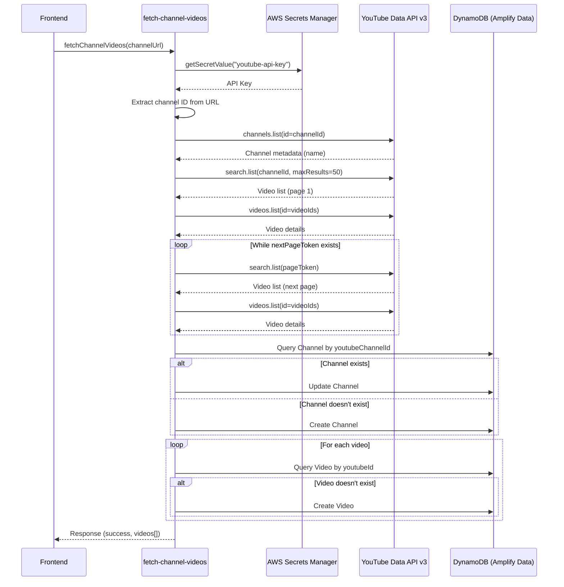

# Design Document: Fetch Channel Videos Refactor

## Overview

This design refactors the placeholder "say-hello" Lambda function into a production-ready "fetch-channel-videos" function that integrates with YouTube Data API v3 to retrieve authentic channel and video metadata. The function will securely access the YouTube API key from AWS Secrets Manager, fetch channel information and all associated videos, persist this data to DynamoDB via Amplify Data, and return structured responses to the frontend.

The refactoring involves renaming the function across all layers (Lambda, schema, backend config, frontend service), enhancing the Channel model with a youtubeChannelId field, implementing YouTube API integration with proper error handling, and ensuring data deduplication when saving videos to the database.

## Architecture

### High-Level Flow



### Component Interactions

1. **Frontend Service Layer** (`youtubeService.ts`): Invokes the Amplify Data query with channel URL
2. **Amplify Data Schema** (`resource.ts`): Defines the fetchChannelVideos query and response types
3. **Lambda Function** (`fetch-channel-videos`): Orchestrates API calls and database operations
4. **AWS Secrets Manager**: Provides secure API key storage and retrieval
5. **YouTube Data API v3**: External service for channel and video metadata
6. **DynamoDB**: Persistent storage for Channel and Video models via Amplify Data

## Components and Interfaces

### 1. Lambda Function Structure

**File: `amplify/functions/fetch-channel-videos/handler.ts`**

```typescript
interface FetchChannelVideosEvent {
  arguments: {
    channelUrl: string;
  };
  identity: {
    sub: string; // Cognito user ID for owner field
  };
}

interface YouTubeVideo {
  youtubeId: string;
  title: string;
  description: string;
  duration: string;
}

interface FetchChannelVideosResponse {
  success: boolean;
  message: string;
  timestamp: string;
  videos: YouTubeVideo[];
}
```

**Core Functions:**

- `handler(event)`: Main entry point, orchestrates the entire flow
- `getYouTubeApiKey()`: Retrieves API key from Secrets Manager
- `extractChannelId(url)`: Parses YouTube URL to extract channel ID
- `fetchChannelMetadata(channelId, apiKey)`: Calls YouTube API for channel info
- `fetchAllVideos(channelId, apiKey)`: Paginated fetch of all channel videos
- `upsertChannel(channelData, owner)`: Creates or updates Channel record
- `saveVideos(videos, channelId, owner)`: Saves videos with deduplication

### 2. Schema Updates

**File: `amplify/data/resource.ts`**

**Changes:**
- Add `youtubeChannelId: a.string()` to Channel model
- Rename custom type from `SayHelloResponse` to `FetchChannelVideosResponse`
- Rename query from `sayHello` to `fetchChannelVideos`
- Update query argument from `name` to `channelUrl`
- Update function import from `sayHello` to `fetchChannelVideos`

**New Schema Excerpt:**
```typescript
Channel: a
  .model({
    name: a.string(),
    url: a.string().required(),
    youtubeChannelId: a.string(), // NEW FIELD
    ebooks: a.hasMany('Ebook', 'channelId'),
    videos: a.hasMany('Video', 'channelId'),
    bookGroups: a.hasMany('BookGroup', 'channelId'),
  }).authorization(allow => [allow.owner()]),

FetchChannelVideosResponse: a.customType({
  message: a.string().required(),
  timestamp: a.string().required(),
  success: a.boolean().required(),
  videos: a.ref('VideoMetadata').array().required(),
}),

fetchChannelVideos: a
  .query()
  .arguments({
    channelUrl: a.string().required(),
  })
  .returns(a.ref('FetchChannelVideosResponse'))
  .authorization(allow => [allow.authenticated()])
  .handler(a.handler.function(fetchChannelVideos)),
```

### 3. YouTube API Integration

**API Endpoints Used:**

1. **channels.list**: Fetch channel metadata
   - Endpoint: `https://www.googleapis.com/youtube/v3/channels`
   - Parameters: `part=snippet`, `id={channelId}`, `key={apiKey}`
   - Response: Channel name, description

2. **search.list**: Find all videos in channel (paginated)
   - Endpoint: `https://www.googleapis.com/youtube/v3/search`
   - Parameters: `part=id`, `channelId={channelId}`, `type=video`, `maxResults=50`, `pageToken={token}`, `key={apiKey}`
   - Response: Video IDs, pagination token

3. **videos.list**: Fetch detailed video metadata
   - Endpoint: `https://www.googleapis.com/youtube/v3/videos`
   - Parameters: `part=snippet,contentDetails`, `id={videoIds}`, `key={apiKey}`
   - Response: Title, description, duration

**URL Parsing Logic:**

Supported URL formats:
- `https://www.youtube.com/channel/{CHANNEL_ID}`
- `https://www.youtube.com/@{HANDLE}` (requires additional API call to resolve)
- `https://www.youtube.com/c/{CUSTOM_URL}` (requires additional API call to resolve)
- `https://www.youtube.com/user/{USERNAME}` (requires additional API call to resolve)

For handle/custom URLs, use `search.list` with `q={handle}` and `type=channel` to resolve to channel ID.

### 4. AWS Secrets Manager Integration

**Secret Configuration:**
- Secret Name: `youtube-api-key`
- Secret Value: Plain text API key string
- Region: Same as Lambda function deployment

**Access Pattern:**
```typescript
import { SecretsManagerClient, GetSecretValueCommand } from "@aws-sdk/client-secrets-manager";

async function getYouTubeApiKey(): Promise<string> {
  const client = new SecretsManagerClient({});
  const command = new GetSecretValueCommand({
    SecretId: "youtube-api-key",
  });
  
  const response = await client.send(command);
  if (!response.SecretString) {
    throw new Error("API key not found in Secrets Manager");
  }
  
  return response.SecretString;
}
```

### 5. Database Operations

**Channel Upsert Logic:**
```typescript
// Query by youtubeChannelId using filter
const existingChannels = await client.models.Channel.list({
  filter: { youtubeChannelId: { eq: youtubeChannelId } }
});

if (existingChannels.data.length > 0) {
  // Update existing channel
  await client.models.Channel.update({
    id: existingChannels.data[0].id,
    name: channelName,
  });
  return existingChannels.data[0].id;
} else {
  // Create new channel
  const result = await client.models.Channel.create({
    name: channelName,
    url: channelUrl,
    youtubeChannelId: youtubeChannelId,
  });
  return result.data.id;
}
```

**Video Deduplication:**
```typescript
// Query existing videos by youtubeId using secondary index
const existingVideo = await client.models.Video.list({
  filter: { youtubeId: { eq: video.youtubeId } }
});

if (existingVideo.data.length === 0) {
  await client.models.Video.create({
    youtubeId: video.youtubeId,
    title: video.title,
    description: video.description || '',
    duration: video.duration,
    channelId: channelId,
  });
}
```

### 6. Frontend Service Updates

**File: `src/services/youtubeService.ts`**

**Changes:**
- Update function call from `client.queries.sayHello` to `client.queries.fetchChannelVideos`
- Update parameter from `name` to `channelUrl`
- Maintain existing error handling and response processing

```typescript
export async function fetchVideosFromYouTube(channelUrl: string): Promise<VideoMetadata[]> {
  const result = await client.queries.fetchChannelVideos({
    channelUrl: channelUrl,
  });

  if (result.errors) {
    throw new Error(result.errors.map(e => e.message).join(', '));
  }

  if (!result.data) {
    throw new Error('No data returned from query');
  }

  if (!result.data.success) {
    throw new Error(result.data.message);
  }

  return result.data.videos || [];
}
```

## Data Models

### Channel Model (Enhanced)

```typescript
{
  id: string;                    // Auto-generated UUID
  name: string | null;           // Channel name from YouTube
  url: string;                   // Original URL provided by user
  youtubeChannelId: string;      // NEW: YouTube's channel ID
  owner: string;                 // Cognito user ID
  createdAt: string;             // Auto-generated timestamp
  updatedAt: string;             // Auto-generated timestamp
  // Relationships
  videos: Video[];
  ebooks: Ebook[];
  bookGroups: BookGroup[];
}
```

### Video Model (Unchanged)

```typescript
{
  id: string;                    // Auto-generated UUID
  youtubeId: string;             // YouTube video ID
  title: string;                 // Video title
  description: string | null;    // Video description
  duration: string | null;       // ISO 8601 duration (e.g., "PT10M30S")
  summary: string | null;        // AI-generated summary (future)
  channelId: string;             // Foreign key to Channel
  owner: string;                 // Cognito user ID
  createdAt: string;             // Auto-generated timestamp
  updatedAt: string;             // Auto-generated timestamp
}
```

### Response Type

```typescript
{
  success: boolean;              // Operation success status
  message: string;               // Human-readable message
  timestamp: string;             // ISO 8601 timestamp
  videos: VideoMetadata[];       // Array of video metadata
}

interface VideoMetadata {
  youtubeId: string;
  title: string;
  description: string;
  duration: string;
}
```

## Correctness Properties

*A property is a characteristic or behavior that should hold true across all valid executions of a system—essentially, a formal statement about what the system should do. Properties serve as the bridge between human-readable specifications and machine-verifiable correctness guarantees.*


### Property 1: URL Parsing Extracts Channel ID

*For any* valid YouTube channel URL (including formats: `/channel/{ID}`, `/@{handle}`, `/c/{custom}`, `/user/{username}`), the URL parsing function should successfully extract or resolve a non-empty channel ID.

**Validates: Requirements 4.2**

### Property 2: Channel Creation Completeness

*For any* new YouTube channel that doesn't exist in the database, creating a channel record should result in a record containing all required fields: a non-empty youtubeChannelId, the channel name from YouTube, and the original URL.

**Validates: Requirements 3.2, 5.2**

### Property 3: Channel Update Preserves Identity

*For any* existing channel record with a matching youtubeChannelId, fetching the channel again should update the channel name to match YouTube's current data while preserving the same database ID and youtubeChannelId.

**Validates: Requirements 5.3**

### Property 4: Video Metadata Completeness

*For any* video fetched from YouTube and saved to the database, the video record should contain all required fields: youtubeId, title, description (or empty string), duration, and channelId.

**Validates: Requirements 4.5, 5.7**

### Property 5: Video Deduplication (Idempotence)

*For any* YouTube channel, fetching and saving videos multiple times should not create duplicate video records - each unique youtubeId should appear exactly once in the database per channel.

**Validates: Requirements 5.6**

### Property 6: Pagination Completeness

*For any* YouTube channel with more than 50 videos, the fetch operation should retrieve all videos by following pagination tokens until no nextPageToken is returned.

**Validates: Requirements 4.4**

### Property 7: Error Responses Are Well-Formed

*For any* error condition (invalid URL, API failure, Secrets Manager failure), the function should return a response with success=false and a non-empty error message describing the failure.

**Validates: Requirements 4.6, 4.7, 6.5, 6.6**

### Property 8: Success Responses Are Complete

*For any* successful execution, the response should have success=true, a non-empty message, a valid ISO 8601 timestamp, and an array of video metadata objects (possibly empty for channels with no videos).

**Validates: Requirements 6.1, 6.2, 6.3, 6.4**

### Property 9: Error Resilience in Batch Operations

*For any* batch of videos being saved, if one video save operation fails, the function should continue processing the remaining videos and successfully save those that don't encounter errors.

**Validates: Requirements 5.8**

### Property 10: Timestamp Format Validity

*For any* response (success or failure), the timestamp field should be a valid ISO 8601 formatted string that can be parsed as a date.

**Validates: Requirements 6.3**

## Error Handling

### Error Categories and Responses

1. **Invalid URL Format**
   - Trigger: URL cannot be parsed or doesn't match YouTube patterns
   - Response: `{ success: false, message: "Invalid YouTube channel URL format", timestamp: ISO8601, videos: [] }`
   - Logging: Log the invalid URL (sanitized)

2. **Secrets Manager Access Failure**
   - Trigger: Cannot retrieve API key from Secrets Manager
   - Response: `{ success: false, message: "Failed to retrieve YouTube API key", timestamp: ISO8601, videos: [] }`
   - Logging: Log the AWS error details
   - Action: Return immediately, do not attempt API calls

3. **YouTube API Errors**
   - Trigger: API returns 4xx or 5xx status codes
   - Response: `{ success: false, message: "YouTube API error: {error details}", timestamp: ISO8601, videos: [] }`
   - Logging: Log API error code, message, and channel ID
   - Common cases:
     - 403: Quota exceeded or invalid API key
     - 404: Channel not found
     - 500: YouTube service error

4. **Channel Not Found**
   - Trigger: YouTube API returns no results for channel ID
   - Response: `{ success: false, message: "Channel not found on YouTube", timestamp: ISO8601, videos: [] }`
   - Logging: Log the channel ID that wasn't found

5. **Database Operation Failures**
   - Trigger: DynamoDB operations fail (create/update/query)
   - Response: Continue processing, log errors
   - Logging: Log the specific operation, record ID, and error details
   - Action: For channel upsert failures, return error response. For individual video save failures, log and continue.

6. **Partial Success**
   - Trigger: Videos fetched successfully but some failed to save
   - Response: `{ success: true, message: "Fetched N videos, M saved successfully", timestamp: ISO8601, videos: [all fetched videos] }`
   - Logging: Log each failed video save operation

### Error Handling Principles

- **Fail Fast for Critical Errors**: If API key retrieval or channel metadata fetch fails, return immediately
- **Resilient for Batch Operations**: If individual video saves fail, continue processing remaining videos
- **Detailed Logging**: Log all errors with sufficient context for debugging
- **User-Friendly Messages**: Return clear, actionable error messages to the frontend
- **No Sensitive Data in Responses**: Never include API keys or internal AWS details in error messages

## Testing Strategy

### Unit Testing with Vitest

Unit tests will focus on specific examples, edge cases, and integration points:

**URL Parsing Tests:**
- Test each supported URL format (channel ID, handle, custom URL, username)
- Test invalid URLs (malformed, non-YouTube domains, missing identifiers)
- Test edge cases (URLs with query parameters, trailing slashes, different protocols)

**API Integration Tests (Mocked):**
- Test successful channel metadata fetch
- Test successful video list fetch with pagination
- Test API error responses (403, 404, 500)
- Test empty channel (no videos)
- Test Secrets Manager integration

**Database Operation Tests (Mocked):**
- Test channel creation for new channel
- Test channel update for existing channel
- Test video creation with deduplication
- Test database error handling

**Response Format Tests:**
- Test success response structure
- Test error response structure
- Test timestamp format validation

### Property-Based Testing with fast-check

Property tests will verify universal properties across all inputs (minimum 100 iterations per test):

**Property Test 1: URL Parsing Robustness**
- Generate random valid YouTube URLs in various formats
- Verify all successfully extract a channel ID
- Tag: **Feature: fetch-channel-videos-refactor, Property 1: URL Parsing Extracts Channel ID**

**Property Test 2: Channel Upsert Idempotence**
- Generate random channel data
- Create channel, then fetch again with updated name
- Verify ID remains same, name updates
- Tag: **Feature: fetch-channel-videos-refactor, Property 3: Channel Update Preserves Identity**

**Property Test 3: Video Metadata Completeness**
- Generate random video metadata from mocked API
- Verify all saved videos have required fields
- Tag: **Feature: fetch-channel-videos-refactor, Property 4: Video Metadata Completeness**

**Property Test 4: Video Deduplication**
- Generate random video list
- Save twice to database
- Verify no duplicates exist (count by youtubeId)
- Tag: **Feature: fetch-channel-videos-refactor, Property 5: Video Deduplication (Idempotence)**

**Property Test 5: Error Response Format**
- Generate random error conditions
- Verify all return success=false with non-empty message
- Tag: **Feature: fetch-channel-videos-refactor, Property 7: Error Responses Are Well-Formed**

**Property Test 6: Success Response Completeness**
- Generate random successful executions
- Verify all have success=true, message, valid timestamp, and videos array
- Tag: **Feature: fetch-channel-videos-refactor, Property 8: Success Responses Are Complete**

**Property Test 7: Batch Error Resilience**
- Generate random video batches with some that will fail
- Verify successful videos are saved despite failures
- Tag: **Feature: fetch-channel-videos-refactor, Property 9: Error Resilience in Batch Operations**

**Property Test 8: Timestamp Validity**
- Generate random responses (success and error)
- Verify all timestamps parse as valid ISO 8601 dates
- Tag: **Feature: fetch-channel-videos-refactor, Property 10: Timestamp Format Validity**

### Testing Configuration

- **Unit tests**: Run on every commit, fast execution (<5 seconds)
- **Property tests**: Run on every commit, 100+ iterations per property
- **Integration tests**: Run against mocked AWS services (Secrets Manager, DynamoDB)
- **Manual testing**: Test against real YouTube API in development environment

### Test Data Strategy

- **Mock YouTube API responses**: Use realistic channel and video data
- **Mock AWS services**: Use aws-sdk-client-mock for Secrets Manager and DynamoDB
- **Property test generators**: Use fast-check to generate valid URLs, channel IDs, video metadata
- **Edge cases**: Empty channels, channels with 1000+ videos, special characters in titles/descriptions

## Implementation Notes

### Dependencies to Add

**Lambda function package.json:**
```json
{
  "dependencies": {
    "@aws-sdk/client-secrets-manager": "^3.x",
    "axios": "^1.x"
  },
  "devDependencies": {
    "@types/node": "^20.x",
    "aws-sdk-client-mock": "^3.x"
  }
}
```

### Lambda Configuration

**Resource definition updates:**
```typescript
export const fetchChannelVideos = defineFunction({
  name: 'fetch-channel-videos',
  entry: './handler.ts',
  timeoutSeconds: 300, // 5 minutes for large channels
  memoryMB: 512,
  environment: {
    YOUTUBE_API_SECRET_NAME: 'youtube-api-key',
  },
});
```

### IAM Permissions Required

The Lambda function needs these permissions (automatically granted by Amplify):
- `secretsmanager:GetSecretValue` for the youtube-api-key secret
- `dynamodb:Query`, `dynamodb:PutItem`, `dynamodb:UpdateItem` for Channel and Video tables
- `logs:CreateLogGroup`, `logs:CreateLogStream`, `logs:PutLogEvents` for CloudWatch logging

### Migration Considerations

1. **Existing Channel Records**: Existing channels in the database won't have youtubeChannelId. The function will populate this field on the next fetch.
2. **Backward Compatibility**: The frontend service maintains the same interface (returns VideoMetadata[]), so no frontend changes needed beyond the function name.
3. **Data Cleanup**: The old sayHello query and SayHelloResponse type should be removed after deployment verification.

### Performance Considerations

- **YouTube API Quota**: Each channel fetch uses ~3-5 quota units (channel metadata + video list + video details). Daily quota is typically 10,000 units.
- **Pagination**: For channels with 1000+ videos, expect 20+ API calls and 30-60 second execution time.
- **Database Operations**: Batch video saves could be optimized with DynamoDB batch write operations in future iterations.
- **Caching**: Consider caching channel metadata and video lists for 24 hours to reduce API calls (future enhancement).

### Security Considerations

- **API Key Protection**: API key stored in Secrets Manager, never logged or returned in responses
- **Owner Authorization**: All database operations use Cognito owner field to ensure users only access their own data
- **Input Validation**: URL parsing includes validation to prevent injection attacks
- **Rate Limiting**: Consider implementing rate limiting on the query to prevent quota exhaustion (future enhancement)
