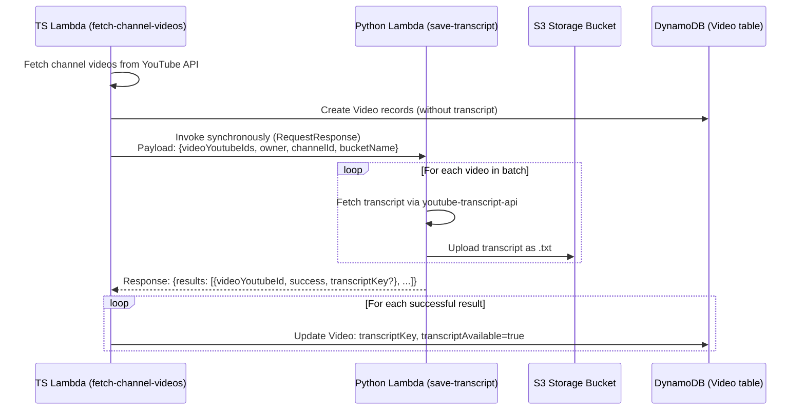

# Design Document: Migrate Transcript to Python Lambda

## Overview

This design migrates transcript fetching from inline TypeScript code in the `fetch-channel-videos` Lambda to a dedicated Python Lambda (`save-transcript`). The Python Lambda uses the `youtube-transcript-api` library for reliable transcript retrieval, uploads results to S3, and returns per-video status to the calling TypeScript Lambda. The TS Lambda then updates DynamoDB records accordingly.

The migration preserves the synchronous invocation model — the TS Lambda waits for transcript results before completing — and maintains full backward compatibility with the existing S3 key format and DynamoDB schema.

## Architecture



The key architectural change is that transcript fetching and S3 upload move entirely to the Python Lambda. The TS Lambda retains responsibility for DynamoDB operations and orchestration.

## Components and Interfaces

### 1. Python Lambda (`save-transcript/index.py`)

Entry point: `handler(event, context)`

**Input (Invocation Payload):**
```json
{
  "videoYoutubeIds": ["abc123", "def456"],
  "owner": "cognito-sub-id",
  "channelId": "dynamodb-channel-id",
  "bucketName": "amplify-storage-bucket-name"
}
```

**Output (Invocation Response):**
```json
{
  "results": [
    {"videoYoutubeId": "abc123", "success": true, "transcriptKey": "transcripts/owner/channelId/abc123.txt"},
    {"videoYoutubeId": "def456", "success": false, "error": "No transcript available"}
  ]
}
```

**Internal flow:**
1. Parse the event payload
2. Validate required fields (`videoYoutubeIds`, `owner`, `channelId`, `bucketName`)
3. For each video ID:
   a. Call `YouTubeTranscriptApi.get_transcript(video_id)` to fetch transcript segments
   b. Concatenate segment texts into plain text
   c. Build S3 key: `transcripts/{owner}/{channelId}/{videoYoutubeId}.txt`
   d. Upload to S3 with `text/plain; charset=utf-8` content type
   e. Record success with key, or record failure with error message
4. Return results list

### 2. Python Lambda Resource (`save-transcript/resource.ts`)

CDK `Function` construct following the `agent-invoker` pattern:
- Runtime: `Python 3.12`
- Timeout: `120 seconds` (sufficient for batch transcript fetching)
- Memory: `256 MB`
- Local bundling: `pip install -r requirements.txt` into output directory, copy `*.py` files
- Dependencies in `requirements.txt`: `youtube-transcript-api`

### 3. TS Lambda Invocation Module (`fetch-channel-videos/transcript-invoker.ts`)

New module replacing the old `transcript.ts`. Provides a single function:

```typescript
async function invokeTranscriptLambda(params: {
  videoYoutubeIds: string[];
  owner: string;
  channelId: string;
  bucketName: string;
  functionName: string;
}): Promise<TranscriptResult[]>
```

**Internal flow:**
1. Build the invocation payload
2. Invoke the Python Lambda using `@aws-sdk/client-lambda` `InvokeCommand` with `RequestResponse` invocation type
3. Parse the response payload
4. Return the results array

**Error handling:**
- If the Lambda invocation fails (FunctionError, timeout), return all videos as failed
- If the response payload cannot be parsed, return all videos as failed

### 4. Modified `database.ts`

The `saveVideos` function changes:
- After creating all new Video records, collect their YouTube IDs
- Make a single call to `invokeTranscriptLambda` with the batch
- Iterate over results and update each successful Video record with `transcriptKey` and `transcriptAvailable: true`

### 5. Backend Wiring (`backend.ts`)

New additions:
- Import and register `saveTranscript` function in `defineBackend`
- Grant `storageBucket.grantWrite(saveTranscriptLambda, 'transcripts/*')`
- Grant `fetchLambda` permission to invoke `saveTranscriptLambda`
- Pass `SAVE_TRANSCRIPT_FUNCTION_NAME` as env var to `fetchLambda`

## Data Models

### Invocation Payload (TS → Python)

| Field | Type | Description |
|-------|------|-------------|
| `videoYoutubeIds` | `string[]` | List of YouTube video IDs to fetch transcripts for |
| `owner` | `string` | Cognito user sub (owner identity) |
| `channelId` | `string` | DynamoDB channel record ID |
| `bucketName` | `string` | S3 bucket name for transcript storage |

### Invocation Response (Python → TS)

| Field | Type | Description |
|-------|------|-------------|
| `results` | `TranscriptResult[]` | Per-video results |

### TranscriptResult

| Field | Type | Description |
|-------|------|-------------|
| `videoYoutubeId` | `string` | The YouTube video ID |
| `success` | `boolean` | Whether transcript was fetched and uploaded |
| `transcriptKey` | `string?` | S3 key if successful |
| `error` | `string?` | Error message if failed |

### Existing DynamoDB Video Model (unchanged)

| Field | Type | Description |
|-------|------|-------------|
| `transcriptKey` | `string?` | S3 key where transcript is stored |
| `transcriptAvailable` | `boolean` | Whether transcript was successfully fetched (default: false) |

No changes to the Amplify data schema are required.


## Correctness Properties

*A property is a characteristic or behavior that should hold true across all valid executions of a system — essentially, a formal statement about what the system should do. Properties serve as the bridge between human-readable specifications and machine-verifiable correctness guarantees.*

### Property 1: Results completeness

*For any* batch of video YouTube IDs sent to the Python Lambda, the returned results list SHALL contain exactly one entry per input video ID, each with a `videoYoutubeId` matching an input ID, a `success` boolean, and (if successful) a `transcriptKey` string.

**Validates: Requirements 1.1, 1.5, 2.1, 2.4**

### Property 2: Segment concatenation preserves content

*For any* list of transcript segments (each with a `text` field), concatenating them into a single plain-text string SHALL produce output that contains every segment's text content.

**Validates: Requirements 1.2**

### Property 3: S3 key format consistency

*For any* valid `owner`, `channelId`, and `videoYoutubeId` strings, the generated S3 key SHALL equal `transcripts/{owner}/{channelId}/{videoYoutubeId}.txt`.

**Validates: Requirements 1.3, 6.1**

### Property 4: Payload validation rejects incomplete input

*For any* invocation payload missing one or more required fields (`videoYoutubeIds`, `owner`, `channelId`, `bucketName`), the Python Lambda SHALL return an error response without attempting any transcript processing.

**Validates: Requirements 1.4**

### Property 5: DB updates match successful transcript results

*For any* Invocation_Response containing a mix of successful and failed results, the TS Lambda SHALL update DynamoDB with `transcriptKey` and `transcriptAvailable: true` only for videos where `success` is true, and SHALL not update videos where `success` is false.

**Validates: Requirements 3.2**

### Property 6: Invocation payload contains exactly new video IDs

*For any* set of newly created (non-duplicate) Video records, the invocation payload sent to the Python Lambda SHALL contain exactly those video YouTube IDs along with the correct `owner`, `channelId`, and `bucketName`.

**Validates: Requirements 3.4**

## Error Handling

### Python Lambda Errors

| Error Scenario | Handling |
|---|---|
| Missing required fields in payload | Return error response with descriptive message; do not process any videos |
| `youtube-transcript-api` raises `TranscriptsDisabled` | Record video as `{success: false, error: "Transcripts disabled"}`, continue batch |
| `youtube-transcript-api` raises `NoTranscriptFound` | Record video as `{success: false, error: "No transcript found"}`, continue batch |
| `youtube-transcript-api` raises unexpected exception | Record video as `{success: false, error: "<message>"}`, continue batch |
| S3 `PutObject` fails for a video | Record video as `{success: false, error: "S3 upload failed: <message>"}`, continue batch |
| Empty `videoYoutubeIds` list | Return `{results: []}` immediately |

### TS Lambda Errors

| Error Scenario | Handling |
|---|---|
| Python Lambda invocation throws (timeout, crash, SDK error) | Log error, set all videos in batch as transcript-failed in stats, do not crash the channel fetch flow |
| Response payload is not valid JSON | Treat as invocation failure, same handling as above |
| Response contains `FunctionError` field | Treat as invocation failure, log the error payload |
| `SAVE_TRANSCRIPT_FUNCTION_NAME` env var missing | Log error, skip transcript processing entirely, continue saving videos without transcripts |

## Testing Strategy

### Unit Tests

Unit tests validate specific examples, edge cases, and integration points:

**Python Lambda (`save-transcript`):**
- Test handler with valid payload returns correct response structure
- Test handler with missing fields returns error
- Test handler with empty `videoYoutubeIds` returns empty results
- Test S3 key building with known inputs
- Test segment concatenation with known segment lists

**TS Lambda (`transcript-invoker.ts`):**
- Test payload construction from known video data
- Test response parsing with known response JSON
- Test error handling when Lambda invoke throws
- Test error handling when response contains `FunctionError`

### Property-Based Tests

Property tests use `fast-check` (TypeScript side) to verify universal properties across randomized inputs. Each property test runs a minimum of 100 iterations.

**TypeScript property tests (Vitest + fast-check):**

- **Feature: migrate-transcript-to-python-lambda, Property 3: S3 key format consistency**
  - Generate random `owner`, `channelId`, `videoYoutubeId` strings
  - Verify the built key matches `transcripts/{owner}/{channelId}/{videoYoutubeId}.txt`

- **Feature: migrate-transcript-to-python-lambda, Property 5: DB updates match successful transcript results**
  - Generate random `TranscriptResult[]` arrays with mixed success/failure
  - Mock DynamoDB client, invoke the update logic
  - Verify update calls match exactly the successful results

- **Feature: migrate-transcript-to-python-lambda, Property 6: Invocation payload contains exactly new video IDs**
  - Generate random arrays of video YouTube IDs
  - Verify the constructed payload contains exactly those IDs

**Python property tests (Hypothesis):**

- **Feature: migrate-transcript-to-python-lambda, Property 1: Results completeness**
  - Generate random lists of video IDs
  - Mock `youtube-transcript-api` and S3 client
  - Verify results list length equals input length and all IDs are present

- **Feature: migrate-transcript-to-python-lambda, Property 2: Segment concatenation preserves content**
  - Generate random lists of transcript segments
  - Verify concatenated output contains every segment's text

- **Feature: migrate-transcript-to-python-lambda, Property 4: Payload validation rejects incomplete input**
  - Generate payloads with random subsets of required fields removed
  - Verify error response is returned

### Testing Libraries

| Language | Test Runner | Property-Based Testing |
|----------|-------------|----------------------|
| TypeScript | Vitest | fast-check |
| Python | pytest | hypothesis |

Each property-based test MUST:
- Run a minimum of 100 iterations
- Reference its design document property in a comment tag
- Be implemented as a single test per property
