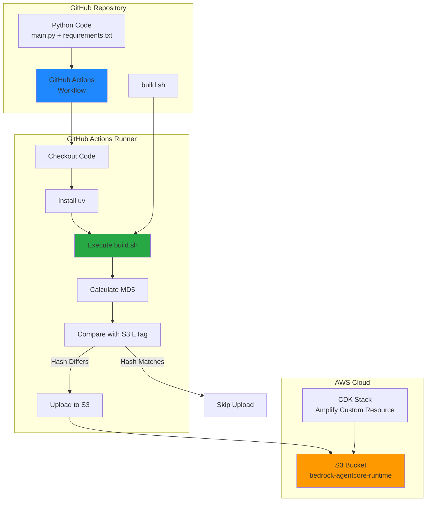

# Design Document: S3 Bedrock Agent Deployment

## Overview

This design implements an automated CI/CD pipeline for deploying a Python-based Bedrock AgentCore runtime package to AWS S3. The solution consists of three main components:

1. **AWS Infrastructure (CDK)**: An S3 bucket with encryption and retention policies
2. **Build System**: A shell script that creates Lambda-compatible deployment packages using the `uv` package manager
3. **CI/CD Pipeline**: A GitHub Actions workflow that builds, compares, and conditionally uploads packages

The system optimizes deployment by using MD5 hash comparison to avoid unnecessary uploads, and enriches deployments with git metadata for traceability.

## Architecture



### Component Interaction Flow

1. **Trigger**: Developer pushes code to `dev` branch
2. **Filter**: GitHub Actions checks if relevant files changed
3. **Build**: Runner executes build script to create deployment package
4. **Compare**: Runner calculates local hash and fetches S3 ETag
5. **Decision**: Upload only if hashes differ
6. **Deploy**: Upload package with git metadata to S3

## Components and Interfaces

### 1. CDK S3 Bucket Resource

**File**: `amplify/storage/bedrock-agent-bucket.ts`

**Purpose**: Define and provision the S3 bucket infrastructure

**Interface**:
```typescript
import { defineStorage } from '@aws-amplify/backend';
import * as s3 from 'aws-cdk-lib/aws-s3';
import { RemovalPolicy } from 'aws-cdk-lib';

export const bedrockAgentBucket = defineStorage({
  name: 'bedrock-agent-bucket',
  access: (allow) => ({
    'bedrock-agent-deployer': [allow.read(), allow.write()]
  })
});

// Custom CDK configuration
export function configureBucket(bucket: s3.Bucket) {
  bucket.applyRemovalPolicy(RemovalPolicy.RETAIN);
  bucket.encryption = s3.BucketEncryption.S3_MANAGED;
}
```

**Key Properties**:
- Bucket naming: `bedrock-agentcore-runtime-${AWS::AccountId}-${AWS::Region}`
- Encryption: AES256 (S3-managed)
- Removal policy: RETAIN (prevents accidental deletion)
- Access: Controlled via IAM policies

### 2. Build Script

**File**: `amplify/functions/bedrock-agent/build.sh`

**Purpose**: Create a Lambda-compatible deployment package with ARM64 dependencies

**Interface**:
```bash
#!/bin/bash
set -e

# Configuration
FUNCTION_DIR="$(cd "$(dirname "${BASH_SOURCE[0]}")" && pwd)"
BUILD_DIR="${FUNCTION_DIR}/build"
DIST_DIR="${FUNCTION_DIR}/dist"
PACKAGE_NAME="bedrock-agent-runtime.zip"

# Main build function
build_package() {
    # 1. Clean previous builds
    rm -rf "${BUILD_DIR}" "${DIST_DIR}"
    mkdir -p "${BUILD_DIR}" "${DIST_DIR}"
    
    # 2. Create virtual environment with uv
    cd "${FUNCTION_DIR}"
    uv venv "${BUILD_DIR}/venv"
    source "${BUILD_DIR}/venv/bin/activate"
    
    # 3. Install dependencies for Lambda ARM64
    uv pip install \
        --python-platform linux \
        --python-version 3.12 \
        --implementation cp \
        --abi cp312 \
        --platform manylinux_2_17_aarch64 \
        -r requirements.txt \
        -t "${BUILD_DIR}/package"
    
    # 4. Copy application code
    cp src/main.py "${BUILD_DIR}/package/"
    
    # 5. Create zip archive
    cd "${BUILD_DIR}/package"
    zip -r "${DIST_DIR}/${PACKAGE_NAME}" .
    
    # 6. Calculate MD5 hash
    md5sum "${DIST_DIR}/${PACKAGE_NAME}" | awk '{print $1}' > "${DIST_DIR}/${PACKAGE_NAME}.md5"
    
    echo "Build complete: ${DIST_DIR}/${PACKAGE_NAME}"
    echo "MD5: $(cat ${DIST_DIR}/${PACKAGE_NAME}.md5)"
}

build_package
```

**Outputs**:
- `dist/bedrock-agent-runtime.zip`: Deployment package
- `dist/bedrock-agent-runtime.zip.md5`: MD5 hash file

### 3. GitHub Actions Workflow

**File**: `.github/workflows/deploy-bedrock-agent.yml`

**Purpose**: Automate the build and deployment process

**Interface**:
```yaml
name: Deploy Bedrock Agent to S3

on:
  push:
    branches:
      - dev
    paths:
      - 'amplify/functions/bedrock-agent/**'
      - '.github/workflows/deploy-bedrock-agent.yml'

env:
  FUNCTION_DIR: amplify/functions/bedrock-agent
  PACKAGE_NAME: bedrock-agent-runtime.zip
  S3_KEY: deployments/bedrock-agent-runtime.zip

jobs:
  deploy:
    runs-on: ubuntu-latest
    
    steps:
      - name: Checkout code
        uses: actions/checkout@v4
        with:
          fetch-depth: 0  # Full history for git metadata
      
      - name: Set up Python
        uses: actions/setup-python@v5
        with:
          python-version: '3.12'
      
      - name: Install uv
        run: pip install uv
      
      - name: Build deployment package
        run: |
          cd ${{ env.FUNCTION_DIR }}
          chmod +x build.sh
          ./build.sh
      
      - name: Calculate local hash
        id: local_hash
        run: |
          LOCAL_MD5=$(cat ${{ env.FUNCTION_DIR }}/dist/${{ env.PACKAGE_NAME }}.md5)
          echo "md5=${LOCAL_MD5}" >> $GITHUB_OUTPUT
          echo "Local MD5: ${LOCAL_MD5}"
      
      - name: Configure AWS credentials
        uses: aws-actions/configure-aws-credentials@v4
        with:
          aws-access-key-id: ${{ secrets.AWS_ACCESS_KEY_ID }}
          aws-secret-access-key: ${{ secrets.AWS_SECRET_ACCESS_KEY }}
          aws-region: ${{ secrets.AWS_REGION }}
      
      - name: Get S3 object ETag
        id: s3_etag
        run: |
          BUCKET_NAME="${{ secrets.BEDROCK_AGENT_BUCKET_NAME }}"
          S3_ETAG=$(aws s3api head-object \
            --bucket "${BUCKET_NAME}" \
            --key "${{ env.S3_KEY }}" \
            --query 'ETag' \
            --output text 2>/dev/null | tr -d '"' || echo "")
          echo "etag=${S3_ETAG}" >> $GITHUB_OUTPUT
          echo "S3 ETag: ${S3_ETAG:-<not found>}"
      
      - name: Compare hashes and upload
        run: |
          LOCAL_MD5="${{ steps.local_hash.outputs.md5 }}"
          S3_ETAG="${{ steps.s3_etag.outputs.etag }}"
          BUCKET_NAME="${{ secrets.BEDROCK_AGENT_BUCKET_NAME }}"
          
          if [ "${LOCAL_MD5}" = "${S3_ETAG}" ]; then
            echo "✓ Package unchanged (MD5: ${LOCAL_MD5}). Skipping upload."
            exit 0
          fi
          
          echo "✗ Package changed. Uploading to S3..."
          echo "  Local MD5:  ${LOCAL_MD5}"
          echo "  Remote ETag: ${S3_ETAG:-<none>}"
          
          aws s3 cp \
            "${{ env.FUNCTION_DIR }}/dist/${{ env.PACKAGE_NAME }}" \
            "s3://${BUCKET_NAME}/${{ env.S3_KEY }}" \
            --metadata "git-commit=${{ github.sha }},git-branch=${{ github.ref_name }}" \
            --content-type "application/zip"
          
          echo "✓ Upload complete"
          echo "  S3 URI: s3://${BUCKET_NAME}/${{ env.S3_KEY }}"
          echo "  Commit: ${{ github.sha }}"
          echo "  Branch: ${{ github.ref_name }}"
```

**Secrets Required**:
- `AWS_ACCESS_KEY_ID`: AWS access key for S3 operations
- `AWS_SECRET_ACCESS_KEY`: AWS secret key
- `AWS_REGION`: Target AWS region (e.g., `us-east-1`)
- `BEDROCK_AGENT_BUCKET_NAME`: Full bucket name

## Data Models

### Deployment Package Structure

```
bedrock-agent-runtime.zip
├── main.py                    # Application entry point
├── <dependency>/              # Python packages
│   ├── __init__.py
│   └── ...
└── <dependency>.dist-info/    # Package metadata
    └── ...
```

### S3 Object Metadata

```json
{
  "Metadata": {
    "git-commit": "abc123def456...",
    "git-branch": "dev"
  },
  "ContentType": "application/zip",
  "ServerSideEncryption": "AES256",
  "ETag": "\"d41d8cd98f00b204e9800998ecf8427e\""
}
```

### Build Artifacts

```
amplify/functions/bedrock-agent/
├── src/
│   └── main.py
├── requirements.txt
├── pyproject.toml
├── build.sh
├── build/                     # Temporary build directory
│   ├── venv/                  # Virtual environment
│   └── package/               # Staged dependencies
└── dist/                      # Output directory
    ├── bedrock-agent-runtime.zip
    └── bedrock-agent-runtime.zip.md5
```

## Error Handling

### Build Script Error Handling

1. **Missing Dependencies**
   - Detection: `uv pip install` exits with non-zero code
   - Response: Script fails immediately with error message
   - Recovery: Developer fixes `requirements.txt` and retries

2. **Invalid Python Version**
   - Detection: `uv` cannot find Python 3.12
   - Response: Script fails with version mismatch error
   - Recovery: Install correct Python version

3. **Insufficient Disk Space**
   - Detection: `zip` command fails
   - Response: Script fails with disk space error
   - Recovery: Clean up build artifacts or increase disk space

### GitHub Actions Error Handling

1. **AWS Authentication Failure**
   - Detection: `configure-aws-credentials` step fails
   - Response: Workflow fails with authentication error
   - Recovery: Verify GitHub Secrets are correctly configured

2. **S3 Access Denied**
   - Detection: `aws s3api head-object` or `aws s3 cp` returns 403
   - Response: Workflow fails with permission error
   - Recovery: Update IAM policies to grant required permissions

3. **Build Failure**
   - Detection: `build.sh` exits with non-zero code
   - Response: Workflow fails at build step
   - Recovery: Check build logs, fix code or dependencies

4. **Hash Comparison Failure**
   - Detection: Unable to retrieve S3 ETag (network error)
   - Response: Treat as "no existing object" and proceed with upload
   - Recovery: Automatic retry on next push

### CDK Deployment Error Handling

1. **Bucket Name Conflict**
   - Detection: CDK deploy fails with bucket already exists
   - Response: CDK stack creation fails
   - Recovery: Delete conflicting bucket or use different name

2. **Insufficient IAM Permissions**
   - Detection: CDK deploy fails with permission error
   - Response: Stack creation fails
   - Recovery: Grant required IAM permissions to deployment role

## Testing Strategy

### Unit Testing

**Build Script Tests**:
- Test clean build from scratch
- Test incremental build (verify cleanup)
- Test with missing dependencies
- Test with invalid Python version
- Test MD5 calculation accuracy

**Test Framework**: Bash unit testing with `bats` (Bash Automated Testing System)

**Example Test**:
```bash
@test "build script creates deployment package" {
  run ./build.sh
  [ "$status" -eq 0 ]
  [ -f "dist/bedrock-agent-runtime.zip" ]
  [ -f "dist/bedrock-agent-runtime.zip.md5" ]
}

@test "build script calculates correct MD5" {
  ./build.sh
  EXPECTED_MD5=$(md5sum dist/bedrock-agent-runtime.zip | awk '{print $1}')
  ACTUAL_MD5=$(cat dist/bedrock-agent-runtime.zip.md5)
  [ "$EXPECTED_MD5" = "$ACTUAL_MD5" ]
}
```

### Integration Testing

**GitHub Actions Workflow Tests**:
- Test workflow triggers on correct branch and paths
- Test workflow skips on unrelated file changes
- Test hash comparison logic (match and mismatch scenarios)
- Test S3 upload with metadata
- Test error handling for missing secrets

**Test Approach**: Use GitHub Actions' `act` tool for local workflow testing

**Example Test Scenarios**:
1. First deployment (no existing S3 object)
2. Unchanged package (hash matches)
3. Changed package (hash differs)
4. Missing AWS credentials
5. S3 bucket does not exist

### Property-Based Testing

Property-based tests will be defined in the Correctness Properties section below.


## Correctness Properties

A property is a characteristic or behavior that should hold true across all valid executions of a system—essentially, a formal statement about what the system should do. Properties serve as the bridge between human-readable specifications and machine-verifiable correctness guarantees.

### Property 1: MD5 Hash Calculation Accuracy

*For any* deployment package created by the build script, the MD5 hash calculated by the script should match the MD5 hash calculated independently by a standard MD5 tool.

**Validates: Requirements 2.4**

**Rationale**: This is a round-trip property that ensures the build script's hash calculation is correct. If the script calculates an incorrect hash, the comparison logic will fail, leading to unnecessary uploads or missed updates.

### Property 2: Conditional Upload Logic

*For any* deployment package and S3 state, when the local MD5 hash differs from the S3 ETag, the workflow should upload the package; when the hashes match, the workflow should skip the upload.

**Validates: Requirements 4.3, 4.4, 4.5**

**Rationale**: This property ensures the core optimization logic works correctly. It combines the comparison and conditional upload requirements into a single testable property.

### Property 3: Git Metadata Round-Trip

*For any* git commit SHA and branch name, when a deployment package is uploaded to S3 with this metadata, retrieving the S3 object metadata should return the same commit SHA and branch name.

**Validates: Requirements 5.1, 5.2, 5.3, 5.4**

**Rationale**: This is a round-trip property that ensures metadata is correctly attached and retrievable. It validates the entire metadata lifecycle from upload to retrieval.

### Property 4: Build Idempotence

*For any* set of source files and dependencies, running the build script multiple times without changing inputs should produce deployment packages with identical MD5 hashes.

**Validates: Requirements 7.1, 7.3**

**Rationale**: This property ensures build reproducibility. If builds are not idempotent, the hash comparison logic becomes unreliable, leading to unnecessary uploads.

### Property 5: Dependency Completeness

*For any* requirements.txt file, the deployment package created by the build script should contain all packages listed in requirements.txt and their transitive dependencies.

**Validates: Requirements 7.4**

**Rationale**: This property ensures that the build process correctly includes all required dependencies. Missing dependencies would cause Lambda function failures at runtime.

### Property 6: Build Failure Propagation

*For any* build error (missing dependency, invalid Python version, disk space), the build script should exit with a non-zero exit code.

**Validates: Requirements 7.5**

**Rationale**: This property ensures that build failures are properly detected by the CI/CD system. If the script exits with zero on failure, the workflow would proceed with an invalid package.

### Property 7: Credential Masking

*For any* GitHub Actions workflow execution, AWS credentials (access key, secret key) should not appear in plain text in workflow logs or outputs.

**Validates: Requirements 6.4**

**Rationale**: This property ensures security by preventing credential exposure. GitHub Actions automatically masks secrets, but this property validates that the masking is effective.

### Property 8: Error Logging Completeness

*For any* workflow error (authentication failure, S3 access denied, build failure), the workflow should log detailed error information and exit with a non-zero code.

**Validates: Requirements 8.5**

**Rationale**: This property ensures that errors are properly logged and propagated. Without proper error handling, debugging deployment failures becomes difficult.

