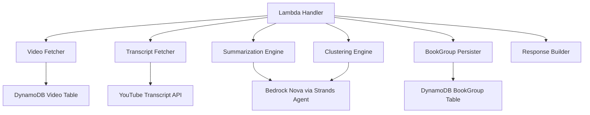

# Design Document: Suggest Book Groups Lambda

## Overview

The suggest-book-groups Lambda function implements AI-powered video clustering for the Kapenz platform. When a user requests grouping suggestions for a YouTube channel, the function fetches videos from DynamoDB, generates summaries for videos that lack them, uses Amazon Bedrock Nova to cluster videos by theme, and persists the suggested groups back to DynamoDB.

This is an MVP implementation optimized for channels with fewer than 100 videos. The design prioritizes simplicity and uses a lazy summarization approach where summaries are generated on-demand and cached for future requests.

## Architecture

### High-Level Flow

```
User Request → Lambda Handler → Fetch Videos → Generate Summaries → Cluster Videos → Save Groups → Return Results
```

### Component Interaction



### Technology Stack

- **Runtime**: Python 3.12
- **AI Framework**: Strands Agent with Amazon Bedrock Nova
- **Database**: DynamoDB (via boto3)
- **Transcript API**: youtube-transcript-api
- **Timeout**: 300 seconds (5 minutes)
- **Memory**: 512 MB

## Components and Interfaces

### 1. Video Fetcher (Existing)

**Purpose**: Retrieve all videos for a channel from DynamoDB

**Function Signature**:
```python
def fetch_videos_by_channel(channel_id: str) -> List[Dict[str, Any]]
```

**Input**:
- `channel_id`: String identifier for the channel

**Output**:
- List of video dictionaries with fields: id, youtubeId, title, description, duration, summary (optional)

**Behavior**:
- Query DynamoDB using byChannel secondary index
- Handle pagination for large result sets
- Return all videos including any existing summaries

### 2. Transcript Fetcher (New)

**Purpose**: Obtain video transcript text for summarization

**Function Signature**:
```python
def fetch_transcript(youtube_id: str, title: str, description: str) -> str
```

**Input**:
- `youtube_id`: YouTube video identifier
- `title`: Video title (fallback)
- `description`: Video description (fallback)

**Output**:
- String containing transcript text or fallback content

**Behavior**:
- Attempt to fetch transcript using youtube-transcript-api
- If transcript unavailable, return formatted string: "Title: {title}\n\nDescription: {description}"
- Log any errors but don't raise exceptions
- Handle API rate limits gracefully

**Error Handling**:
- Catch TranscriptsDisabled exception → use fallback
- Catch NoTranscriptFound exception → use fallback
- Catch any other exception → log and use fallback

### 3. Summarization Engine (New)

**Purpose**: Generate concise summaries of video content using AI

**Function Signature**:
```python
def generate_summary(agent: Agent, transcript: str, video_title: str) -> str
```

**Input**:
- `agent`: Configured Strands Agent instance
- `transcript`: Video transcript or fallback text
- `video_title`: Video title for context

**Output**:
- String containing 200-250 word summary

**Prompt Template**:
```
Summarize this video transcript in 200-250 words, focusing on:
- Main topics and themes
- Key concepts and ideas
- Core subject matter

Video Title: {video_title}

Transcript:
{transcript}

Provide a concise summary that captures the essence of the content.
```

**Behavior**:
- Send prompt to Bedrock Nova via Strands Agent
- Extract summary text from AI response
- Trim whitespace and validate non-empty response
- Raise exception if AI returns empty or invalid response

### 4. Clustering Engine (New)

**Purpose**: Group videos into thematic clusters using AI

**Function Signature**:
```python
def cluster_videos(agent: Agent, videos: List[Dict[str, Any]]) -> List[Dict[str, Any]]
```

**Input**:
- `agent`: Configured Strands Agent instance
- `videos`: List of video dictionaries with id, youtubeId, title, summary

**Output**:
- List of group dictionaries with title, themeDescription, videoIds

**Prompt Template**:
```
Analyze these video summaries and group them into logical thematic clusters.

Requirements:
- Create 3-8 groups based on natural content themes
- Each group should contain videos with strongly related content
- Groups should represent coherent topics suitable for a book
- Ensure every video is assigned to exactly one group

Videos:
{formatted_video_list}

Return your response as a JSON array with this exact structure:
[
  {
    "title": "Compelling group name",
    "themeDescription": "What this group is about (1-2 sentences)",
    "videoIds": ["video_id_1", "video_id_2", ...]
  },
  ...
]

Return ONLY the JSON array, no additional text.
```

**Video List Format**:
```
Video ID: {video_id}
Title: {title}
Summary: {summary}

---

Video ID: {video_id}
Title: {title}
Summary: {summary}

...
```

**Behavior**:
- Format videos into structured text for AI analysis
- Send clustering prompt to Bedrock Nova
- Parse JSON response from AI
- Validate response structure (array of objects with required fields)
- Ensure all videoIds in response exist in input videos
- Raise exception if response is invalid or unparseable

### 5. BookGroup Persister (New)

**Purpose**: Save suggested groups to DynamoDB

**Function Signature**:
```python
def save_book_groups(channel_id: str, groups: List[Dict[str, Any]], owner: str) -> None
```

**Input**:
- `channel_id`: Channel identifier
- `groups`: List of group dictionaries from clustering
- `owner`: User identifier for authorization

**Output**:
- None (raises exception on failure)

**Behavior**:
- Get BookGroup table name from environment variable
- For each group, create DynamoDB item with:
  - channelId: provided channel_id
  - title: from group
  - themeDescription: from group
  - videoIds: from group
  - createdAt: current ISO timestamp
  - owner: provided owner
- Use batch write for efficiency
- Raise exception if any write fails

### 6. Agent Client Factory (Update Existing)

**Purpose**: Create configured Strands Agent with Bedrock Nova

**Function Signature**:
```python
def create_agent_client() -> Agent
```

**Current Implementation**: Uses xAI model

**Required Changes**:
- Replace xAIModel with BedrockModel
- Use Amazon Bedrock Nova model identifier
- Configure with AWS credentials from environment or IAM role
- Keep temperature at 0.7 and max_tokens at 2048

**New Implementation**:
```python
from strands import Agent
from strands_bedrock import BedrockModel

def create_agent_client() -> Agent:
    model = BedrockModel(
        model_id="amazon.nova-pro-v1:0",  # Bedrock Nova model
        params={
            "temperature": 0.7,
            "max_tokens": 2048
        }
    )
    agent = Agent(model=model)
    return agent
```

### 7. Video Summary Updater (New)

**Purpose**: Update Video records with generated summaries

**Function Signature**:
```python
def update_video_summary(video_id: str, summary: str) -> None
```

**Input**:
- `video_id`: DynamoDB record ID for the video
- `summary`: Generated summary text

**Output**:
- None (raises exception on failure)

**Behavior**:
- Get Video table name from environment variable
- Update the Video item with the summary field
- Use conditional update to avoid overwriting if record was deleted
- Raise exception if update fails

## Data Models

### Video Model (Updated)

```typescript
Video: {
  id: string (DynamoDB generated)
  youtubeId: string (required)
  title: string (required)
  description: string (optional)
  duration: string
  summary: string (optional)  // NEW FIELD
  channelId: string (required)
  owner: string (required, from auth)
  createdAt: string (auto-generated)
  updatedAt: string (auto-generated)
}
```

**Schema Update Required**: Add `summary: a.string()` to Video model in amplify/data/resource.ts

### BookGroup Model (Existing)

```typescript
BookGroup: {
  id: string (DynamoDB generated)
  channelId: string (required)
  title: string (required)
  themeDescription: string (optional)
  videoIds: string[] (required)
  createdAt: datetime (required)
  owner: string (required, from auth)
  updatedAt: string (auto-generated)
}
```

### Lambda Event Structure

**Input**:
```typescript
{
  arguments: {
    channelId: string
  },
  identity: {
    sub: string  // User ID for owner field
  }
}
```

**Output**:
```typescript
{
  success: boolean
  groups: Array<{
    title: string
    themeDescription: string
    videoIds: string[]
  }>
  error?: string
}
```

## Correctness Properties

*A property is a characteristic or behavior that should hold true across all valid executions of a system—essentially, a formal statement about what the system should do. Properties serve as the bridge between human-readable specifications and machine-verifiable correctness guarantees.*


### Property Reflection

After analyzing all acceptance criteria, I've identified the following redundancies:
- Properties 1.2 and 3.4 both test summary persistence (consolidate into one)
- Properties 2.4 and 7.1 both test transcript error handling with fallback (consolidate into one)
- Properties 5.1 and 5.3 both test BookGroup record creation (consolidate into one)
- Properties 4.5 and 9.5 both test group response structure validation (consolidate into one)
- Properties 7.2, 7.3, 7.4, and 9.6 all test error response format (consolidate into one comprehensive property)

### Correctness Properties

**Property 1: Summary Persistence**
*For any* video and generated summary, after updating the video record in DynamoDB, querying that video should return the same summary value.
**Validates: Requirements 1.2, 3.4**

**Property 2: Summary Retrieval**
*For any* video with an existing summary in DynamoDB, fetching videos for that channel should include the summary field in the returned video data.
**Validates: Requirements 1.3**

**Property 3: Transcript Availability**
*For any* video with available captions, the transcript fetching function should return non-empty text content.
**Validates: Requirements 2.2**

**Property 4: Transcript Fallback**
*For any* video without available transcripts, the transcript fetching function should return a string containing both the video's title and description.
**Validates: Requirements 2.3, 2.4, 7.1**

**Property 5: Summary Generation Trigger**
*For any* video lacking a summary field, the main handler should invoke the summarization function for that video.
**Validates: Requirements 3.1**

**Property 6: Summary Input Content**
*For any* video being summarized, the prompt sent to the AI should contain either the transcript text or the title+description fallback.
**Validates: Requirements 3.2**

**Property 7: Summary Caching**
*For any* video that already has a summary, the main handler should skip summary generation and use the existing cached value.
**Validates: Requirements 3.5**

**Property 8: Clustering Input Completeness**
*For any* set of videos sent for clustering, the formatted prompt should include the video ID, title, and summary for each video.
**Validates: Requirements 4.1, 4.3**

**Property 9: Clustering Response Validation**
*For any* response from the clustering AI, the validation function should verify that each group contains a title (non-empty string), themeDescription (string), and videoIds (non-empty array).
**Validates: Requirements 4.4, 4.5, 9.5**

**Property 10: BookGroup Record Creation**
*For any* set of N groups returned from clustering, exactly N BookGroup records should be created in DynamoDB.
**Validates: Requirements 5.1, 5.3**

**Property 11: BookGroup Field Completeness**
*For any* BookGroup record created, it should contain all required fields: channelId, title, themeDescription, videoIds, createdAt, and owner.
**Validates: Requirements 5.2**

**Property 12: Success Response Format**
*For any* successful grouping operation, the response should have success: true and a groups array containing the created groups.
**Validates: Requirements 5.4, 9.4**

**Property 13: Pagination Handling**
*For any* channel with more videos than fit in a single DynamoDB page, the fetch function should continue retrieving pages until all videos are returned.
**Validates: Requirements 8.3**

**Property 14: Input Extraction**
*For any* valid Lambda event with an arguments.channelId field, the handler should correctly extract the channelId value.
**Validates: Requirements 9.1**

**Property 15: Error Response Format**
*For any* error condition (missing channelId, no videos, AI failure, DynamoDB failure), the response should have success: false and a non-empty error message describing the failure.
**Validates: Requirements 7.2, 7.3, 7.4, 9.2, 9.3, 9.6**

**Property 16: Error Logging**
*For any* error that occurs during processing, the handler should log error details to CloudWatch before returning the error response.
**Validates: Requirements 7.5, 8.4**

## Error Handling

### Transcript Fetching Errors
- **TranscriptsDisabled**: Video has captions disabled → Use title+description fallback
- **NoTranscriptFound**: No captions available → Use title+description fallback
- **Network errors**: API timeout or connection issues → Use title+description fallback
- **Rate limiting**: Too many requests → Log warning, use fallback, continue processing

### AI Operation Errors
- **Summarization failure**: AI returns empty/invalid response → Log error, raise exception, return error to user
- **Clustering failure**: AI returns unparseable response → Log error, raise exception, return error to user
- **Timeout**: AI request exceeds timeout → Log error, raise exception, return error to user
- **Invalid API key**: Authentication failure → Log error, raise exception, return error to user

### DynamoDB Errors
- **Video fetch failure**: Query fails → Log error, raise exception, return error to user
- **Video update failure**: Update operation fails → Log warning, continue processing (summary will be regenerated next time)
- **BookGroup save failure**: Write operation fails → Log error, raise exception, return error to user
- **Pagination errors**: LastEvaluatedKey handling fails → Log error, raise exception, return error to user

### Input Validation Errors
- **Missing channelId**: Return error response immediately
- **Empty video list**: Return error response immediately
- **Invalid event structure**: Log error, return error response

### Error Response Structure
All errors return:
```python
{
    'success': False,
    'groups': [],
    'error': 'Descriptive error message'
}
```

## Testing Strategy

This is an MVP implementation, so comprehensive testing is not required. However, the design supports future testing with the following approach:

### Unit Testing Approach
Unit tests should focus on:
- **Transcript fetching**: Test fallback behavior with mocked youtube-transcript-api
- **Prompt formatting**: Verify prompts contain required content
- **Response parsing**: Test JSON parsing and validation logic
- **Error handling**: Verify error responses have correct format
- **DynamoDB operations**: Test with mocked boto3 client

### Property-Based Testing Approach
Property tests should verify universal behaviors:
- **Summary persistence round-trip**: Generate random summaries, save, fetch, verify equality
- **Transcript fallback**: Generate random videos without transcripts, verify fallback format
- **Clustering response validation**: Generate random AI responses, verify validation catches invalid structures
- **Error response format**: Generate random error conditions, verify all return proper error structure
- **Pagination handling**: Generate random large video sets, verify all are fetched

### Property Test Configuration
- Use **fast-check** library for property-based testing
- Run minimum **100 iterations** per property test
- Tag each test with: **Feature: suggest-book-groups-lambda, Property N: [property text]**
- Each correctness property should map to a single property-based test

### Integration Testing Approach
Integration tests should verify:
- End-to-end flow with real DynamoDB (local)
- AI integration with mocked Bedrock responses
- Error propagation through the full handler

### Testing Priorities for Future Work
1. **High Priority**: Error handling, response validation, DynamoDB operations
2. **Medium Priority**: Transcript fetching, prompt formatting, summary caching
3. **Low Priority**: AI response quality, performance benchmarks

## Implementation Notes

### Environment Variables Required
- `VIDEO_TABLE_NAME`: DynamoDB table name for Video records
- `BOOKGROUP_TABLE_NAME`: DynamoDB table name for BookGroup records
- AWS credentials (via IAM role or environment)

### Dependencies to Add
```
youtube-transcript-api==0.6.1
strands-bedrock  # Bedrock integration for Strands
```

### Dependencies to Remove
```
strands-xai  # Replacing with Bedrock
```

### Lambda Configuration Updates
- Ensure IAM role has permissions for:
  - DynamoDB: Query, UpdateItem, PutItem on Video and BookGroup tables
  - Bedrock: InvokeModel permission for Nova model
- Timeout: 300 seconds (5 minutes)
- Memory: 512 MB

### Performance Considerations
- **First run**: Expect 2-5 minutes for 50 videos (summarization is slow)
- **Subsequent runs**: Expect 10-30 seconds (only clustering needed)
- **Optimization**: Summaries are cached, so repeated grouping requests are fast
- **Scalability limit**: ~100 videos per channel (context window constraint)

### Future Enhancements
- **Batch summarization**: Process multiple videos in parallel
- **Embedding-based clustering**: Scale to 1000+ videos
- **Incremental summarization**: Generate summaries during channel addition
- **Progress callbacks**: Real-time progress updates to frontend
- **Transcript storage**: Cache transcripts for ebook generation
