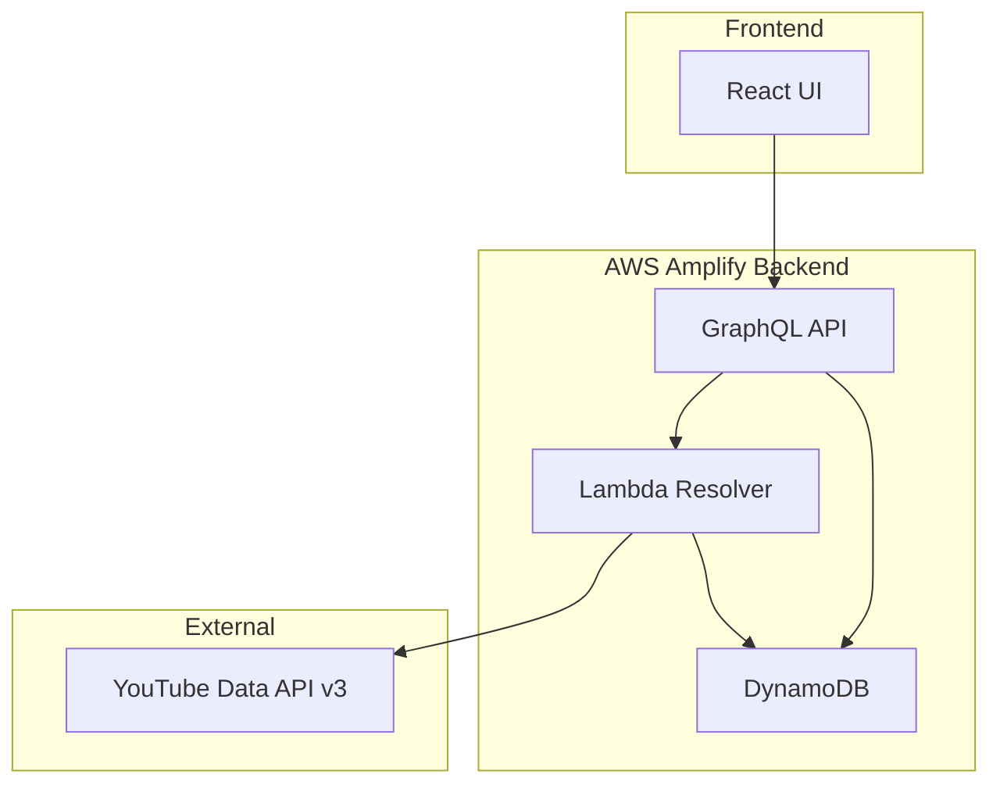

# Design Document: Video Listing Feature

## Overview

The video listing feature enables users to automatically fetch and display video metadata from their YouTube channels. When a user creates or updates a channel with a YouTube URL, the system automatically retrieves video information and stores it in DynamoDB for quick access. The feature integrates with the existing AWS Amplify Gen2 architecture using GraphQL, TypeScript, and React.

## Architecture

The system follows a serverless architecture pattern with clear separation of concerns:



**Data Flow:**
1. User creates/updates channel with YouTube URL in React UI
2. GraphQL mutation triggers Lambda resolver
3. Lambda resolver calls YouTube Data API v3 to fetch video metadata
4. Video data is stored in DynamoDB with owner-based authorization
5. React UI receives real-time updates via GraphQL subscriptions
6. Videos are displayed grouped by channel

## Components and Interfaces

### 1. GraphQL Schema Extensions

**Video Model:**
```typescript
type Video @model @auth(rules: [{ allow: owner }]) {
  id: ID!
  youtubeId: String! @index(name: "byYoutubeId")
  title: String!
  description: String
  duration: String
  channelId: ID! @index(name: "byChannel")
  channel: Channel @belongsTo(fields: ["channelId"])
  owner: String
}
```

**Channel Model Extension:**
```typescript
type Channel @model @auth(rules: [{ allow: owner }]) {
  id: ID!
  name: String!
  url: String!
  videos: [Video] @hasMany(indexName: "byChannel", fields: ["id"])
  owner: String
  // ... existing fields
}
```

### 2. Lambda Resolver Function

**Purpose:** Fetch video metadata from YouTube Data API v3 when channel is created/updated

**Key Responsibilities:**
- Validate YouTube channel URL format
- Extract channel ID from URL
- Call YouTube Data API v3 to fetch video list
- Transform API response to match GraphQL schema
- Store video metadata in DynamoDB
- Handle API rate limits and errors

**Interface:**
```typescript
interface YouTubeVideoFetcher {
  fetchChannelVideos(channelUrl: string, ownerId: string): Promise<VideoMetadata[]>
}

interface VideoMetadata {
  youtubeId: string
  title: string
  description: string
  duration: string
}
```

### 3. React Components

**VideoList Component:**
```typescript
interface VideoListProps {
  channelId: string
}

interface VideoItemProps {
  video: Video
}
```

**Key Features:**
- Real-time data synchronization using `observeQuery()`
- Loading states during video fetching
- Error handling for API failures
- Responsive grid layout for video display

### 4. YouTube API Integration

**API Endpoints Used:**
- `channels.list` - Get channel details and uploads playlist ID
- `playlistItems.list` - Get videos from uploads playlist
- `videos.list` - Get detailed video metadata (duration, statistics)

**Authentication:**
- YouTube Data API v3 key stored in AWS Systems Manager Parameter Store
- Server-side API calls only (no client-side YouTube API access)

## Data Models

### Video Entity
```typescript
interface Video {
  id: string                    // Auto-generated UUID
  youtubeId: string            // YouTube video ID (unique)
  title: string                // Video title
  description?: string         // Video description (truncated if needed)
  duration: string             // ISO 8601 duration format (PT4M13S)
  channelId: string            // Foreign key to Channel
  owner: string                // Cognito user ID (auto-populated)
}
```

### Channel Entity (Extended)
```typescript
interface Channel {
  id: string
  name: string
  url: string
  videos?: Video[]             // One-to-many relationship
  owner: string
}
```

### DynamoDB Table Structure

**Videos Table:**
- Primary Key: `id` (String)
- GSI1: `byYoutubeId` - Partition Key: `youtubeId`
- GSI2: `byChannel` - Partition Key: `channelId`
- Owner-based authorization enforced at GraphQL level

**Access Patterns:**
1. Get all videos for a channel (by channelId)
2. Get specific video by YouTube ID (for deduplication)
3. Get videos by owner (implicit through channel ownership)

## Error Handling

### YouTube API Error Scenarios

**Invalid Channel URL:**
- Validation: URL format checking before API call
- Response: User-friendly error message with format examples

**API Rate Limiting:**
- Strategy: Exponential backoff with jitter
- Fallback: Queue requests for later processing
- User Feedback: "Fetching videos, this may take a moment"

**Channel Not Found/Private:**
- Detection: YouTube API returns 404 or access denied
- Response: Clear error message explaining the issue

**Network/Service Errors:**
- Retry Logic: 3 attempts with exponential backoff
- Timeout: 30 seconds per API call
- Fallback: Store partial data if some videos succeed

### GraphQL Error Handling

**Mutation Errors:**
- Validation errors returned in GraphQL error format
- Client displays specific field errors
- Partial success scenarios handled gracefully

**Subscription Errors:**
- Automatic reconnection for network issues
- Fallback to polling if subscriptions fail
- User notification for persistent connection issues

## Implementation Notes

This is an MVP focused on core functionality. The implementation will prioritize:

1. **Basic Video Fetching**: Get video metadata from YouTube channels
2. **Simple Storage**: Store videos in DynamoDB with owner authorization  
3. **Basic UI**: Display videos in a simple list format
4. **Error Handling**: Basic error messages for common failure cases

Advanced features like comprehensive testing, detailed error handling, and performance optimization will be addressed in future iterations.

## Error Handling

### YouTube API Error Scenarios

**Invalid Channel URL:**
- Validation: URL format checking before API call
- Response: User-friendly error message with format examples

**API Rate Limiting:**
- Strategy: Exponential backoff with jitter
- Fallback: Queue requests for later processing
- User Feedback: "Fetching videos, this may take a moment"

**Channel Not Found/Private:**
- Detection: YouTube API returns 404 or access denied
- Response: Clear error message explaining the issue

**Network/Service Errors:**
- Retry Logic: 3 attempts with exponential backoff
- Timeout: 30 seconds per API call
- Fallback: Store partial data if some videos succeed

### GraphQL Error Handling

**Mutation Errors:**
- Validation errors returned in GraphQL error format
- Client displays specific field errors
- Partial success scenarios handled gracefully

**Subscription Errors:**
- Automatic reconnection for network issues
- Fallback to polling if subscriptions fail
- User notification for persistent connection issues
