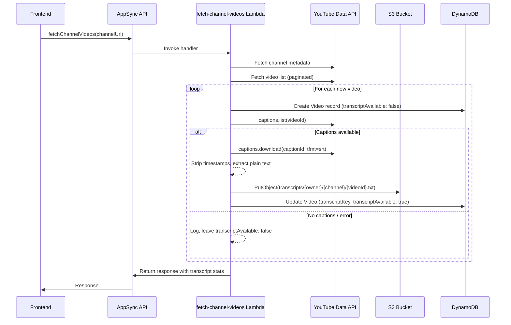

# Design Document: Video Transcription Storage

## Overview

This feature extends the existing `fetch-channel-videos` Lambda to also fetch YouTube captions and store them as plain text files in S3. The design modifies three existing files (`amplify/data/resource.ts`, `amplify/storage/resource.ts`, `amplify/backend.ts`) and extends the Lambda handler (`amplify/functions/fetch-channel-videos/handler.ts`) with new transcription logic.

The approach is intentionally non-blocking: transcript failures for individual videos do not halt the overall import. The Lambda already processes videos in a loop with per-video error handling, and the transcription step slots into this pattern naturally.

### Key Design Decisions

1. **YouTube captions via `googleapis` library**: The Lambda already depends on `googleapis`. We use the `youtube.captions.list` endpoint to discover tracks and `youtube.captions.download` to fetch content. This avoids adding new dependencies.
2. **AWS SDK S3 client for uploads**: We use `@aws-sdk/client-s3` (available in the Lambda runtime) to upload transcript files directly, rather than routing through Amplify's storage client.
3. **Inline transcript processing**: Caption fetching and S3 upload happen inside the existing `saveVideos` loop, right after a new video is created. This keeps the flow simple and avoids a separate orchestration step.
4. **Owner ID from Cognito `sub`**: The S3 key uses the Cognito `sub` (same as `owner` in the data model) as the `{owner_id}` segment, matching Amplify's `{entity_id}` convention.

## Architecture



## Components and Interfaces

### 1. Modified: `amplify/data/resource.ts` — Video Model

Add two fields to the existing `Video` model:

```typescript
Video: a
  .model({
    // ... existing fields ...
    transcriptKey: a.string(),              // S3 key, null if no transcript
    transcriptAvailable: a.boolean().default(false), // false until transcript stored
    // ... existing relations and auth ...
  })
```

### 2. Modified: `amplify/storage/resource.ts` — Storage Access Rules

Add a new path entry to the existing storage definition:

```typescript
export const storage = defineStorage({
  name: 'videoTranscripts',
  access: (allow) => ({
    'profile-pictures/{entity_id}/*': [
      allow.entity('identity').to(['read', 'write', 'delete'])
    ],
    'picture-submissions/*': [
      allow.authenticated.to(['read', 'write']),
    ],
    'transcripts/{entity_id}/*': [
      allow.entity('identity').to(['read'])  // Users can only read their own
    ],
  })
});
```

### 3. Modified: `amplify/backend.ts` — Lambda S3 Write Access

Grant the `fetch-channel-videos` Lambda write access to the storage bucket's `transcripts/` prefix:

```typescript
const storageBucket = backend.storage.resources.bucket;
const fetchLambda = backend.fetchChannelVideos.resources.lambda as Function;

storageBucket.grantWrite(fetchLambda, 'transcripts/*');
```

Also pass the bucket name as an environment variable to the Lambda:

```typescript
fetchLambda.addEnvironment('TRANSCRIPT_BUCKET_NAME', storageBucket.bucketName);
```

### 4. New functions in `handler.ts` — Transcription Logic

#### `fetchTranscript(videoYoutubeId: string, apiKey: string): Promise<string | null>`

Fetches captions for a single video:
1. Call `youtube.captions.list({ part: 'snippet', videoId })` to get available tracks
2. Select the best track: prefer English (`en`), fall back to first available
3. Call `youtube.captions.download({ id: captionId, tfmt: 'srt' })` to get SRT content
4. Strip SRT timestamps and sequence numbers, return plain text
5. Return `null` if no tracks available or on error

#### `stripSrtTimestamps(srtContent: string): string`

Pure function that converts SRT-formatted caption content to plain text:
1. Remove sequence numbers (lines that are just digits)
2. Remove timestamp lines (`00:00:00,000 --> 00:00:01,000`)
3. Remove HTML-like tags (`<i>`, `</i>`, etc.)
4. Collapse multiple blank lines into single line breaks
5. Trim leading/trailing whitespace

#### `uploadTranscriptToS3(params: { bucketName: string, key: string, content: string }): Promise<void>`

Uploads plain text content to S3:
1. Create `S3Client` instance (reused across calls via module-level singleton)
2. Call `PutObjectCommand` with `ContentType: 'text/plain; charset=utf-8'`

#### `processTranscript(params: { videoYoutubeId: string, channelId: string, owner: string, apiKey: string, bucketName: string }): Promise<{ success: boolean, key?: string }>`

Orchestrates the full transcript flow for a single video:
1. Call `fetchTranscript` — if null, return `{ success: false }`
2. Build S3 key: `transcripts/${owner}/${channelId}/${videoYoutubeId}.txt`
3. Call `uploadTranscriptToS3`
4. Return `{ success: true, key }`
5. On any error, log and return `{ success: false }`

### 5. Modified: `saveVideos` function in `handler.ts`

After creating a new video record, call `processTranscript`. If successful, update the video record:

```typescript
// After: const result = await client.models.Video.create({...})
if (result.data) {
  const transcriptResult = await processTranscript({
    videoYoutubeId: video.youtubeId,
    channelId,
    owner,
    apiKey,
    bucketName,
  });
  
  if (transcriptResult.success && transcriptResult.key) {
    await client.models.Video.update({
      id: result.data.id,
      transcriptKey: transcriptResult.key,
      transcriptAvailable: true,
    });
    transcriptStats.successful++;
  } else {
    transcriptStats.failed++;
  }
}
```

For skipped (duplicate) videos, increment `transcriptStats.skipped`.

## Data Models

### Video Model (updated fields only)

| Field | Type | Required | Default | Description |
|-------|------|----------|---------|-------------|
| `transcriptKey` | `string` | No | `null` | S3 object key for the transcript file |
| `transcriptAvailable` | `boolean` | No | `false` | Whether a transcript has been stored |

### S3 Object Key Format

```
transcripts/{owner_id}/{channel_id}/{video_youtube_id}.txt
```

- `owner_id`: Cognito user `sub` (matches `{entity_id}` in Amplify storage paths)
- `channel_id`: DynamoDB channel record ID (UUID)
- `video_youtube_id`: YouTube video ID (e.g., `dQw4w9WgXcQ`)

### Transcript Stats (internal to Lambda response)

```typescript
interface TranscriptStats {
  successful: number;  // Transcripts fetched and stored
  failed: number;      // Fetch or upload errors
  skipped: number;     // Duplicate videos, no transcript attempt
}
```


## Correctness Properties

*A property is a characteristic or behavior that should hold true across all valid executions of a system — essentially, a formal statement about what the system should do. Properties serve as the bridge between human-readable specifications and machine-verifiable correctness guarantees.*

The following properties were derived from the acceptance criteria prework analysis. Each property is universally quantified and suitable for property-based testing with `fast-check`.

### Property 1: SRT stripping produces clean plain text

*For any* valid SRT-formatted string, applying `stripSrtTimestamps` SHALL produce output that contains no SRT sequence numbers (lines matching `^\d+$`), no timestamp lines (matching `\d{2}:\d{2}:\d{2}`), and no HTML-like tags (matching `<[^>]+>`).

**Validates: Requirements 2.2, 3.3**

### Property 2: English track preference

*For any* list of caption track objects that includes at least one track with language code `en`, the track selection function SHALL return a track with language code `en`.

**Validates: Requirements 2.3**

### Property 3: S3 key format correctness

*For any* valid owner ID, channel ID, and video YouTube ID (non-empty strings), the generated S3 key SHALL match the pattern `transcripts/{owner_id}/{channel_id}/{video_youtube_id}.txt` and SHALL contain exactly those three path segments after the `transcripts/` prefix.

**Validates: Requirements 3.1**

### Property 4: Transcript stats invariant

*For any* list of videos processed by the transcript flow, the sum of `successful + failed + skipped` in the returned transcript stats SHALL equal the total number of input videos.

**Validates: Requirements 5.3, 5.4**

## Error Handling

### Caption Fetch Errors

- If `captions.list` returns an HTTP error (403, 404, etc.), catch the error, log it with the video YouTube ID, and return `null` from `fetchTranscript`.
- If the video has captions disabled or the API key lacks caption access, treat as "no captions available" (not a fatal error).
- Network timeouts on the YouTube API should be caught and logged, not re-thrown.

### S3 Upload Errors

- If `PutObjectCommand` fails (access denied, bucket not found, network error), catch the error, log the S3 key and error message, and return `{ success: false }` from `processTranscript`.
- The video record remains with `transcriptAvailable: false` — no partial state.

### Video Record Update Errors

- If the `Video.update` call fails after a successful S3 upload, log the error. The transcript file exists in S3 but the DB record doesn't reference it. This is an acceptable inconsistency — the file is orphaned but harmless, and a re-import would overwrite it.

### General Resilience

- All transcript-related errors are caught per-video inside the `saveVideos` loop.
- The overall video import flow never fails due to transcript errors.
- The response message includes transcript stats so the caller knows what happened.

## Testing Strategy

### Property-Based Tests (fast-check)

Each correctness property maps to a single property-based test with a minimum of 100 iterations. Tests are co-located with the handler at `amplify/functions/fetch-channel-videos/handler.test.ts`.

| Property | Test Description | Generator Strategy |
|----------|------------------|--------------------|
| Property 1 | Generate random SRT strings with timestamps, sequence numbers, and HTML tags. Verify output is clean. | `fc.array(fc.record({ seq: fc.nat(), start: fc.string(), end: fc.string(), text: fc.string() }))` to build SRT blocks |
| Property 2 | Generate random arrays of caption track objects with varying language codes, ensuring at least one `en`. Verify selection. | `fc.array(fc.record({ language: fc.string() }))` with forced `en` insertion |
| Property 3 | Generate random non-empty strings for owner, channel, and video IDs. Verify key format. | `fc.string({ minLength: 1 }).filter(s => !s.includes('/'))` for each segment |
| Property 4 | Generate arrays of video processing results (success/fail/skip). Verify sum invariant. | `fc.array(fc.constantFrom('success', 'fail', 'skip'))` |

Each test must be tagged with a comment:
```typescript
// Feature: video-transcription-storage, Property N: <property_text>
```

### Unit Tests (Vitest)

Unit tests cover specific examples, edge cases, and integration points:

- **stripSrtTimestamps**: Empty string input, single-line SRT, multi-line with nested HTML tags
- **fetchTranscript**: Mock YouTube API returning no tracks, returning error, returning valid SRT
- **selectCaptionTrack**: Empty track list, single non-English track, multiple tracks with English
- **buildTranscriptKey**: Verify exact key format with known inputs
- **processTranscript**: Mock S3 success, mock S3 failure, mock YouTube failure
- **saveVideos integration**: Verify transcript stats are accumulated correctly across multiple videos

### Test Configuration

- Runner: Vitest with `globals: true`, `environment: 'node'`
- PBT library: `fast-check` (already in devDependencies)
- Mocking: `aws-sdk-client-mock` for S3, `vi.mock` for YouTube API calls
- Minimum PBT iterations: 100 per property
- Test file: `amplify/functions/fetch-channel-videos/handler.test.ts`
